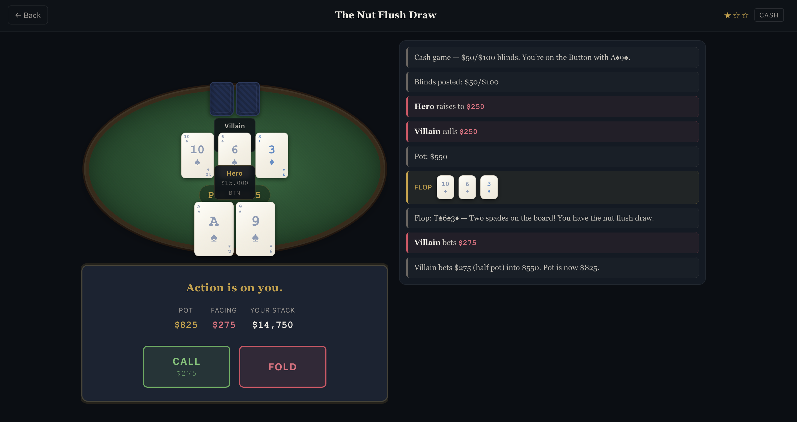

# ♠ Poker Decisions

An interactive poker training app that teaches you the math behind every decision. Play through realistic poker hands, make your call, and then see the step-by-step math that proves whether you were right.



## What It Does

You sit at a virtual poker table. Cards are dealt, opponents bet, the pot grows — and at the critical moment, the app asks: **"What do you do?"**

After you decide, the app reveals:
- ✅ Whether the math supports your decision
- 📊 Step-by-step breakdown: outs, equity, pot odds, implied odds
- 💡 A takeaway principle you can use at real tables

No math is shown before you decide. You learn by doing, not by reading.

## Features

- **15 hand-crafted scenarios** across 3 difficulty tiers (Beginner → Intermediate → Advanced)
- **Full poker math engine** — Monte Carlo equity, outs counting, pot odds, implied odds, SPR, draw visibility
- **Immersive table UI** — green felt, realistic cards, sequential action feed that builds tension
- **Two-column desktop layout** — table + decision on the left, action narrative + math reveal on the right
- **Progressive math reveal** — each step animates in so you read sequentially
- **Stats tracking** — accuracy, completed scenarios, concepts mastered (persisted in localStorage)
- **Responsive** — works on desktop (primary), tablet, and mobile

## Concepts Taught

| Tier | Concepts |
|------|----------|
| ⭐ Beginner | Pot odds, outs counting, Rule of 2, equity vs price, implied odds basics |
| ⭐⭐ Intermediate | Stack depth & implied odds, set mining (15× rule), combo draws, corrected rule (3x+8), gutshots, reverse implied odds |
| ⭐⭐⭐ Advanced | Blocker effects, semi-bluff raising, multiway equity dilution, reverse implied odds, ICM & tournament pressure |

## Tech Stack

- **React 19** with Vite
- **Pure client-side** — no backend, all game logic runs in the browser
- **Monte Carlo equity simulation** (10,000 iterations)
- **Hand evaluator** — 5-card and 7-card evaluation with all edge cases
- **Vitest** for testing (321 tests across engine, scenarios, and integration)

## Getting Started

```bash
# Install dependencies
npm install

# Start dev server
npm run dev

# Run tests
npm test

# Build for production
npm run build
```

## Project Structure

```
src/
  engine/          — Cards, hand evaluator, equity calculator, outs counter, math formulas
  scenarios/       — 15 hand-crafted scenarios with validation tests
  components/      — Card, Table, ActionFeed, DecisionPrompt, MathReveal, ScenarioMenu, ScenarioPlay
  coach/           — AI Coach integration (Phase 5 — coming soon)
  styles.css       — Design system: CSS variables, animations, responsive breakpoints
  App.jsx          — State-based routing
  userStats.js     — localStorage persistence
```

## Roadmap

- [x] **Phase 1** — Core math engine (cards, evaluator, equity, outs, formulas)
- [x] **Phase 2** — 15 scenario library with validation
- [x] **Phase 3** — Poker table UI, action feed, decision prompt, math reveal
- [x] **Phase 4** — Home screen, routing, stats, visual polish, two-column layout
- [ ] **Phase 5** — AI Coach powered by Claude (contextual, Socratic, never spoils decisions)
- [ ] **Phase 6** — Free Play sandbox mode
- [ ] **Phase 7** — Scenario Director (scale to millions of real tournament hands)

## License

See [LICENSE](LICENSE) for details.
